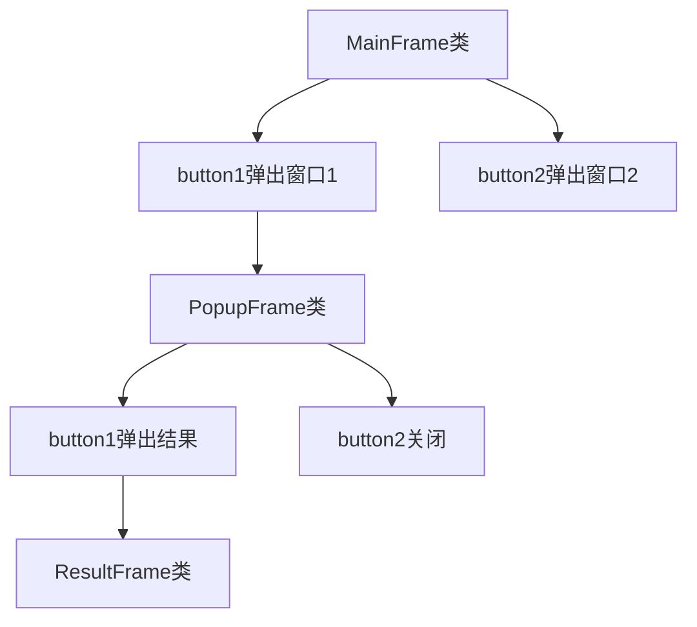

# 源代码

```c++
#include <wx/wx.h>  // 引入 wxWidgets 头文件

// 结果窗口类
class ResultFrame : public wxFrame {
public:
    // 构造函数，设置窗口标题和大小
    ResultFrame(const wxString& title)
        : wxFrame(NULL, wxID_ANY, title, wxDefaultPosition, wxSize(200, 100)) {
        
        wxPanel* panel = new wxPanel(this, wxID_ANY);  // 创建一个面板
        // 创建一个静态文本控件，用于显示结果
        wxStaticText* text = new wxStaticText(panel, wxID_ANY, "结果页面", wxPoint(20, 20));
    }
};

// 弹出窗口类
class PopupFrame : public wxFrame {
public:
    // 构造函数，设置窗口标题和大小
    PopupFrame(const wxString& title)
        : wxFrame(NULL, wxID_ANY, title, wxDefaultPosition, wxSize(200, 150)) {
        
        wxPanel* panel = new wxPanel(this, wxID_ANY);  // 创建一个面板
        
        // 创建第一个按钮，并绑定点击事件到 OnButtonResult 方法
        wxButton* button1 = new wxButton(panel, wxID_ANY, "弹出结果", wxPoint(20, 20));
        button1->Bind(wxEVT_BUTTON, &PopupFrame::OnButtonResult, this);
        
        // 创建第二个按钮，并绑定点击事件到 OnClose 方法
        wxButton* button2 = new wxButton(panel, wxID_ANY, "关闭", wxPoint(20, 60));
        button2->Bind(wxEVT_BUTTON, &PopupFrame::OnClose, this);
    }

private:
    // 按钮点击事件处理函数，弹出结果窗口
    void OnButtonResult(wxCommandEvent& event) {
        ResultFrame* resultFrame = new ResultFrame("结果");  // 创建结果窗口
        resultFrame->Show(true);  // 显示结果窗口
    }

    // 按钮点击事件处理函数，关闭当前弹出窗口
    void OnClose(wxCommandEvent& event) {
        Close(true);  // 关闭窗口
    }
};

// 主窗口类
class MainFrame : public wxFrame {
public:
    // 构造函数，设置窗口标题和大小
    MainFrame(const wxString& title)
        : wxFrame(NULL, wxID_ANY, title, wxDefaultPosition, wxSize(300, 200)) {
        
        wxPanel* panel = new wxPanel(this, wxID_ANY);  // 创建一个面板
        
        // 创建第一个按钮，并绑定点击事件到 OnButtonPopup1 方法
        wxButton* button1 = new wxButton(panel, wxID_ANY, "弹出窗口 1", wxPoint(20, 20));
        button1->Bind(wxEVT_BUTTON, &MainFrame::OnButtonPopup1, this);
        
        // 创建第二个按钮，并绑定点击事件到 OnButtonPopup2 方法
        wxButton* button2 = new wxButton(panel, wxID_ANY, "弹出窗口 2", wxPoint(20, 60));
        button2->Bind(wxEVT_BUTTON, &MainFrame::OnButtonPopup2, this);
    }

private:
    // 按钮点击事件处理函数，弹出 PopupFrame
    void OnButtonPopup1(wxCommandEvent& event) {
        PopupFrame* popupFrame = new PopupFrame("弹出窗口 1");  // 创建弹出窗口
        popupFrame->Show(true);  // 显示弹出窗口
    }

    // 按钮点击事件处理函数，处理弹出窗口 2 的逻辑
    void OnButtonPopup2(wxCommandEvent& event) {
        wxMessageBox("点击了弹出窗口 2 按钮");  // 弹出消息框
    }
};

// 应用程序类
class MyApp : public wxApp {
public:
    // 初始化应用程序
    virtual bool OnInit() {
        MainFrame* frame = new MainFrame("主窗口");  // 创建主窗口
        frame->Show(true);  // 显示主窗口
        return true;  // 返回 true 表示初始化成功
    }
};

// 程序入口点
wxIMPLEMENT_APP(MyApp);  // 实现应用程序
```

## 运行结果


# 代码原理



